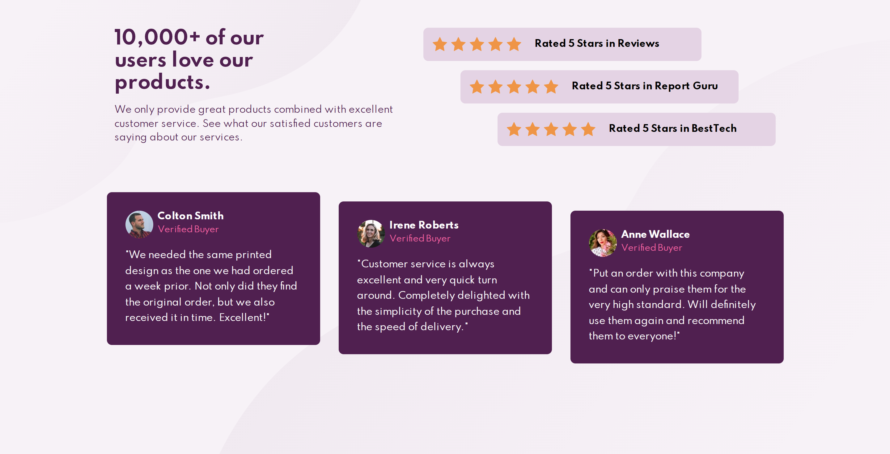

# Social proof section

This is a solution to the [Social proof section challenge on Frontend Mentor](https://www.frontendmentor.io/challenges/social-proof-section-6e0qTv_bA). Frontend Mentor challenges help you improve your coding skills by building realistic projects.

## The challenge

Users should be able to:

- View the optimal layout for the section depending on their device's screen size

## Built with

- Semantic HTML5 markup
- CSS custom properties
- Flexbox
- Mobile-first workflow

## Screenshots

## Links

- Solution URL: [https://www.frontendmentor.io/solutions/social-proof-section-DWco8Gkn5M](https://www.frontendmentor.io/solutions/social-proof-section-DWco8Gkn5M)

- Live Site URL: [https://codereme.github.io/social-proof-section](https://codereme.github.io/social-proof-section)

## Author

- Frontend Mentor - [@codereme](https://www.frontendmentor.io/profile/codereme)
- Github - [@codereme](https://github.com/codereme)
